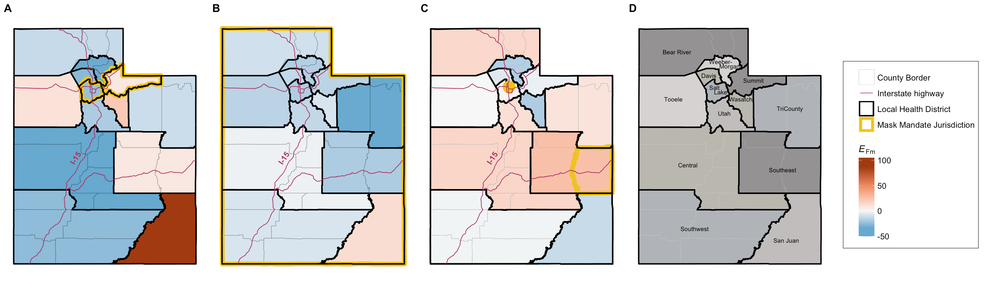

# The Effectiveness of Face Mask Mandates on COVID-19 Transmission in Utah

by Alicia Horn, Holly Shoemaker and Lindsay Keegan

This paper is in press at [Public Health Reports](https://journals.sagepub.com/home/phr).

## Description
The objective of this study was to describe how face mask mandates at the state, county, and local levels differed in their effectiveness in reducing the number of COVID-19 cases in the jurisdiction where the mandate was implemented and throughout Utah. Using the method outlined in Britton et al.[2021](https://royalsocietypublishing.org/doi/full/10.1098/rspa.2021.0151) we calculated the effectiveness of face mask mandates ($$E_{Fm}$$) on reducing COVID-19 transmission. We calculated the $$E_{Fm}$$ for all local health districts (LHDs) in Utah after 3 dates: June 27-28, 2020 (Salt Lake/Summit County [SLSC] face mask mandates issued), November 9, 2020 (statewide face mask mandate issued), and April 10, 2021 (all mandates lifted except in Salt Lake City). Overall, we found that most counties in Utah had a reduction in transmission of COVID-19 after face mask mandates were implemented (Figure 1). On average, we found an 11.9% reduction reductions in $$E_{Fm}$$, with 8 of 13 local health districts experiencing a reduction after the introduction of the SLSC face mask mandates and on average a 12.7% reduction, with 12 of 13 local health districts experiencing a reduction in $$E_{Fm}$$ after the statewide mandate. After mandates were lifted, many counties had an increase in $$E_{Fm}$$.

Figure 1: The effectiveness of face mask mandates ($$E_{Fm}$$) on transmission of COVID-19 in Utah after implementation or lifting of face mask mandates, where a negative $$E_{Fm}$$ indicates a reduction in transmission and a positive $$E_{Fm}$$ indicates an increase in transmission. I-15 runs north–south through Utah for 400 miles. (A) After implementation of face mask mandates in Salt Lake and Summit counties on June 27-28, 2020. (B) After implementation of the statewide mandate on November 9, 2020. (C) After lifting the statewide mandate on April 10, 2021. (D) Identification of counties in Utah.

## Abstract
Objective: Throughout the COVID-19 pandemic, the effectiveness of face mask mandates was intensely debated. The objective of this study was to describe how face mask mandates at the state, county, and local levels differed in their effectiveness in reducing the number of COVID-19 cases in the jurisdiction where the mandate was implemented and throughout Utah.

Methods: We used publicly available data from the Utah Department of Health and Human Services. We calculated the effectiveness of face mask mandates ($$E_{Fm}$$) in each local health district after 3 key mandates: the enactment of face mask mandates in Salt Lake and Summit counties (SLSC) on June 28, 2020, and June 27, 2020, respectively; the enactment of a statewide face mask mandate on November 9, 2020; and the lifting of the statewide face mask mandate on April 10, 2021.

Results: Most counties in Utah had a reduction in the growth rate of COVID-19 cases after enactment of face mask mandates. On average, we found an 11.9% reduction reductions in $$E_{Fm}$$, with 8 of 13 local health districts experiencing a reduction after the introduction of the SLSC face mask mandates and on average a 12.7% reduction, with 12 of 13 local health districts experiencing a reduction in $$E_{Fm}$$ after the statewide mandate. After mandates were lifted, many counties had an increase in $$E_{Fm}$$.

Conclusion: Face mask mandates were an effective way to reduce transmission of COVID-19 in local jurisdictions and in neighboring jurisdictions in Utah. Our evidence supports the use of face mask mandates as a way to prevent disease transmission and be better equipped to respond to future pandemics.

## Software implementation

All source code used to generate the results and figures in the paper are in the `code` folder and all data are in the `data` folder. 

# Source code for producing the results and figures

The all code is in [MaskMandateScript_LK](MaskMandateScript_LK.R). This script produces all of the results in the following order:
1. Visualizes the variant data from Utah
2. Creates incidence plots
3. Calculates the $$E_{fm}$$ by county for the Salt Lake/Summit County (SLSC) mandate, the statewide mandate, and lifting the statewide mandate
4. Creating a labeled map of all LHDs
5. Visualizes the vaccination data
6. Conducts a supplemental analysis changing the generation time

## Dependencies

The following R packages are required for this project:

- [`dplyr`](https://cran.r-project.org/package=dplyr): for data manipulation.
- [`lubridate`](https://cran.r-project.org/package=lubridate): for working with date-times.
- [`tidyverse`](https://cran.r-project.org/package=tidyverse): a collection of R packages for data science.
- [`readr`](https://cran.r-project.org/package=readr): for reading rectangular data like CSV files.
- [`maps`](https://cran.r-project.org/package=maps): for creating geographical maps.
- [`ggplot2`](https://cran.r-project.org/package=ggplot2): for data visualization.
- [`segmented`](https://cran.r-project.org/package=segmented): for regression models with segmented relationships.
- [`cowplot`](https://cran.r-project.org/package=cowplot): for publication-ready plots, with a custom theme set using `theme_cowplot(font_size=18)`.
- [`scales`](https://cran.r-project.org/package=scales): for better control of axis breaks and labels.
- [`sf`](https://cran.r-project.org/package=sf): for working with spatial data.
- [`ggnewscale`](https://cran.r-project.org/package=ggnewscale): for adding multiple color scales to a `ggplot2` plot.

## Data

The data used in this study is provided in `data` and a full description is in the README.md files in the `data` directory. In brief, this study uses publicly avaialbe data from the [Utah COVID data dashboard](https://coronavirus-dashboard.utah.gov/overview.html) as well as publicly available shapefile data for mapping the data to LHDs. 

# Contact
For inquiries, please contact lindsay.keegan@utah.edu

